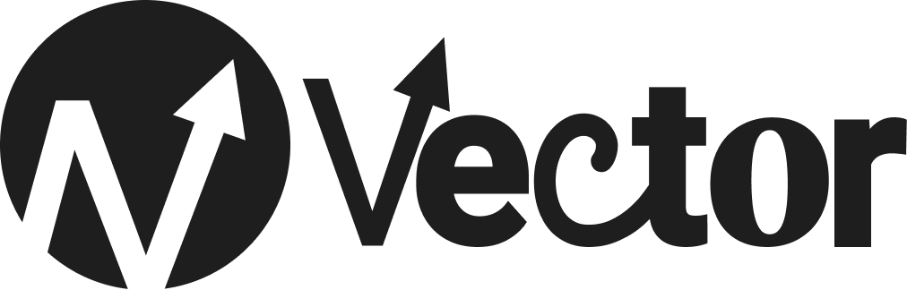
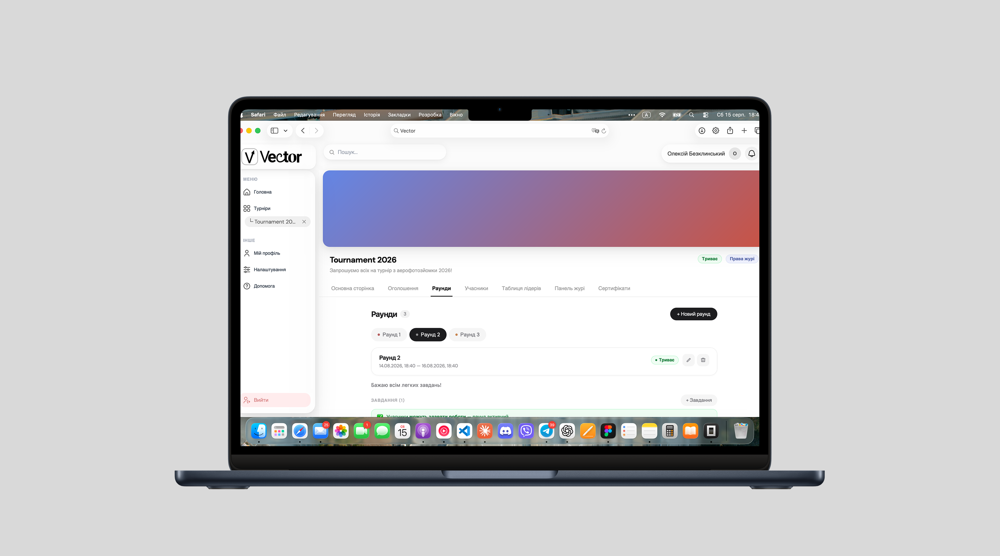
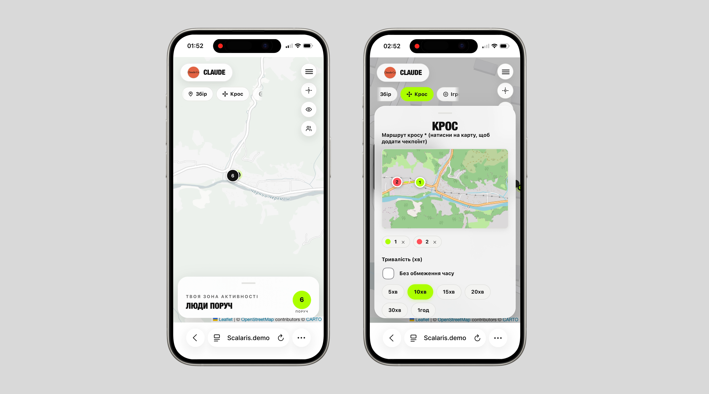

# Hi, I'm Oleksii 👋

**Full-stack Web Developer · Team Lead · Product & UI Design**

I build web platforms end-to-end — from business logic and backend architecture
to UI design and frontend implementation — and lead small teams through
national-level competitions.

---

## About me

I'm a full-stack developer who also designs the products I build — UI, branding,
logos — and takes ownership of the business logic behind them, not just the code.
In both projects below I was **team lead**: I shaped the product idea, designed
the UI/UX and brand identity, and led the team through building the app on a
tight deadline.

- 🥉 **3rd place**, All-Ukrainian team programming tournament — *Scalaris*
- 🏁 **Finalist**, All-Ukrainian team programming tournament — *Vector*
- 🧠 Comfortable across the stack: React frontends, Django/DRF backends, real-time
  features with WebSockets, PostgreSQL/PostGIS
- 🎨 Design my own UI, branding and logos for the products I lead

---

## Featured Projects

<table>
<tr>
<td width="50%" valign="top">

### [Vector — Academic Tournament Platform](https://github.com/ttjelky/vector)

A full-stack platform for organizing academic tournaments in any subject —
individual or team format — with roles, live leaderboards, notifications and
certificates.

Built in **3 months** as a team project. Our team reached the **final** of the
All-Ukrainian team programming tournament with it.

**My role:** team lead, full-stack development, UI/UX & brand design, business logic

`React` `Vite` `Django` `DRF` `SQLite` `JWT`

</td>
<td width="50%" valign="top">

### [Scalaris — Live Activity Map](https://github.com/ttjelky/Scalaris)

A mobile-first platform with a live map for organizing street/backyard
activities with friends nearby.

Built in **5 days** at a summer tech camp during the tournament final. Our team
won **3rd place** at the All-Ukrainian team programming tournament with it.

**My role:** team lead, full-stack development, UI/UX & brand design, business logic

`React` `Vite` `Django` `DRF` `Channels` `PostgreSQL/PostGIS` `Redis`

</td>
</tr>
</table>

---

## Tech Stack

---

📫 Let's connect — [Telegram](https://t.me/ttjelky) · [bezklinskiyalexey@gmail.com](mailto:bezklinskiyalexey@gmail.com) · [Portfolio](https://ttjelky.github.io/portfolio/)

